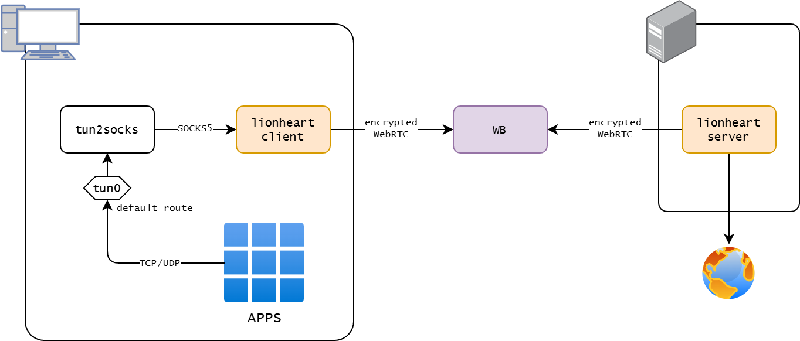

# Lionheart Windows Launcher

Данный репозиторий позволяет создавать туннелирование всего трафика через socks5 от lionheart на Windows.

Ссылка на оригинальный репозиторий [lionheart](https://github.com/jaykaiperson/lionheart).
Перед началом работы ознакомьтесь с ним.

---



Этот проект собирает в одной папке Windows-лаунчер для связки:

- `lionheart` как SOCKS5-клиент
- `tun2socks` как TUN -> SOCKS5 мост
- `wintun.dll` как драйвер TUN для Windows

## Быстрый старт

Запускать лаунчер нужно с правами администратора, иначе настройка интерфейса и маршрутов Windows не сработает.

Быстрая установка и запуск из PowerShell:

```powershell
irm https://github.com/ig-rudenko/lionheart-windows-manager/raw/refs/heads/master/install.ps1 | iex
```

## Что делает установщик

Установщик:

- создаёт папку `%USERPROFILE%\lionheart`
- скачивает `vpn-lionheart.ps1`
- скачивает `vpn-lionheart.bat`
- показывает в терминале путь установки и краткую инструкцию
- создаёт ярлык `Lionheart VPN` на рабочем столе
- запускает лаунчер с запросом UAC

При первом запуске сам лаунчер уже докачает остальные зависимости.

## Как пользоваться

1. Запустить `Lionheart VPN` с рабочего стола или файл `vpn-lionheart.bat` из `%USERPROFILE%\lionheart`
2. Вставить `smart-key` от сервера
3. Нажать `Connect`

Лаунчер:

- сам скачивает зависимости
- принимает `smart-key`
- сам генерирует клиентский `config.json` для `lionheart`
- запускает `lionheart`
- ждёт появления SOCKS5 на `127.0.0.1:1080`
- запускает `tun2socks`
- настраивает IP и route для TUN-интерфейса

Скрипт создаёт рядом с собой:

- `config.json` — клиентский конфиг `lionheart`
- `vpn-lionheart-config.json` — сохранённый `smart-key`

## Внешние зависимости

При старте лаунчер автоматически скачивает отсутствующие файлы в папку проекта.

Используются такие источники:

- `lionheart`: `https://github.com/jaykaiperson/lionheart/releases/download/v1.2/lionheart-1.2-windows-x64.exe`
- `tun2socks`: `https://github.com/xjasonlyu/tun2socks/releases/download/v2.6.0/tun2socks-windows-amd64.zip`
- `wintun`: `https://github.com/ig-rudenko/lionheart-windows-manager/raw/refs/heads/master/extra/wintun.dll`

Примечания:

- для `tun2socks` скачивается ZIP-архив, из него извлекается `tun2socks-windows-amd64.exe`
- для `wintun` скачивается сразу готовый `wintun.dll`, без распаковки
- для `lionheart` используется каноническое имя `lionheart-windows-x64.exe`
- если рядом уже лежит старый файл `lionheart-1.2-windows-x64.exe`, скрипт тоже сможет его использовать

## Ручное обновление бинарников

Если не хочется полагаться на автозагрузку, файлы можно положить вручную рядом со скриптом:

- `lionheart-windows-x64.exe`
- `tun2socks-windows-amd64.exe`
- `wintun.dll`

Тогда скрипт ничего скачивать не будет.

## Ограничения

- без прав администратора Windows-сценарий работать не будет
- автозагрузка зависимостей требует доступ в интернет
- если upstream поменяет имена файлов или URL релизов, нужно обновить переменные в скрипте
